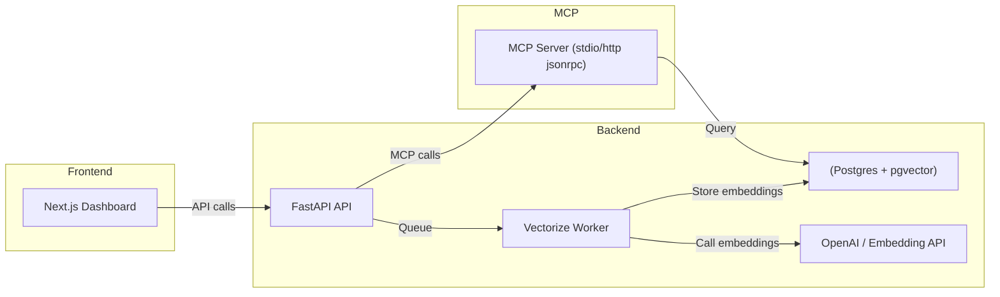

# RAG MCP Project

中文: [README.md](README.md)

## Overview

RAG MCP (Model Context Protocol) is a comprehensive system designed to manage and interact with large language models (LLMs) using a modular and extensible architecture. It provides tools for vectorization, storage, and data retrieval, and offers API integration for client applications.

## Features

- **Vectorization**: Convert text data into vector representations to enable efficient similarity searches.
- **Storage**: Store and manage vectorized data using a database backend.
- **Search**: Perform similarity searches to retrieve relevant data.
- **API Integration**: Provide RESTful APIs for client interactions.
- **Frontend Dashboard**: A Next.js-based dashboard for managing and monitoring the system.
- **Dockerized Environment**: Pre-configured Docker setup for easy deployment.

## Project Structure

```
rag_mcp/
├── api/                # Backend APIs: vectorize, upload, search
├── assets/             # Static assets
├── core/               # Core services and schemas
├── database/           # Database models and initialization
├── docker/             # Docker configuration
├── front/              # Next.js frontend dashboard
├── logs/               # Log files
├── mcp_server/         # MCP server implementation
├── test/               # System tests
├── upload/             # Uploaded files
├── utils/              # Utility functions
```

## Installation

### Prerequisites

- Python 3.9+
- Node.js 18+
- Docker
- PostgreSQL

### Steps

1. Clone the repo:
   ```bash
   git clone https://github.com/hellolukeding/rag_mcp.git
   cd rag_mcp
   ```
2. Set up a Python environment:
   ```bash
   python3 -m venv .venv
   source .venv/bin/activate
   pip install -r requirements.txt
   ```
3. Install frontend dependencies:
   ```bash
   cd front/client
   npm install
   ```
4. Start Docker containers:
   ```bash
   cd ../../docker
   docker-compose up -d
   ```
5. Run the backend server:
   ```bash
   cd ../mcp_server/server
   python mcp_server.py
   ```
6. Start the frontend:
   ```bash
   cd ../../front/client
   npm run dev
   ```

## Usage

### Dashboard

Open your browser and navigate to `http://localhost:3000` to access the dashboard.

### API Endpoints

- **Start captcha**: `POST /api/v1/auth/captcha/start`
- **Upload file**: `POST /api/v1/upload`
- **Search**: `GET /api/v1/search`

For detailed API documentation, refer to the `api/` directory.

## Connecting to MCP Server

The MCP server exposes a JSON-RPC interface that clients can use to interact with it. Below are instructions for connecting to the MCP server.

### Start the MCP server

The server supports two transport modes: stdio (default) and Streamable HTTP (recommended).

Stdio mode (default):

```bash
# Start using the script (stdio mode)
PYTHONPATH=. poetry run python mcp/scripts/start_server.py --transport stdio
```

Streamable HTTP mode (recommended):

```bash
# Start MCP server in HTTP mode, default listening at 127.0.0.1:18080
PYTHONPATH=. poetry run python mcp/server/mcp_server.py --transport http --http-host 127.0.0.1 --http-port 18080
```

### Using Python client

```python
import requests
import json

# MCP server endpoint
MCP_SERVER_URL = "http://127.0.0.1:18080/jsonrpc"

# Define JSON-RPC request
payload = {
    "jsonrpc": "2.0",
    "method": "vectorize",
    "params": {"text": "This is a sample text"},
    "id": 1
}

# Send request
response = requests.post(MCP_SERVER_URL, data=json.dumps(payload), headers={"Content-Type": "application/json"})

# Handle response
if response.status_code == 200:
    result = response.json()
    print("Vectorization result:", result)
else:
    print("Request failed, status code:", response.status_code)
```

### Parameters

- `method`: The MCP method to call, e.g., `vectorize`.
- `params`: The method parameters, e.g., the text to vectorize.
- `id`: Unique identifier for the request.

### Available Methods

- `vectorize`: Converts text to vector representation.
- `search`: Performs a similarity search by vector.
- `upload`: Upload a file.

Refer to the `api/` directory for more details about methods and arguments.

---

## Developer docs

This section provides developer-focused details including API docs addresses, required environment variables, run commands, and a high-level architecture diagram.

### Swagger / OpenAPI

The backend service is implemented with FastAPI. In development mode you can access API docs:

- Swagger UI: `http://localhost:8000/docs`
- ReDoc: `http://localhost:8000/redoc`

Replace `localhost:8000` with your server host and port if different.

### MCP Server (JSON-RPC)

MCP Server can run in stdio mode (default) or Streamable HTTP mode:

- stdio: for local in-process use
- Streamable HTTP (JSON-RPC endpoint): `http://127.0.0.1:18080/jsonrpc`

Example using Python requests (Streamable HTTP):

```python
import requests
import json

url = "http://127.0.0.1:18080/jsonrpc"
payload = {
   "jsonrpc": "2.0",
   "method": "vectorize",
   "params": {"text": "Sample text to vectorize"},
   "id": 1
}
response = requests.post(url, data=json.dumps(payload), headers={"Content-Type": "application/json"})
print(response.json())
```

### Key environment variables

Recommended `.env` entries:

```bash
# OpenAI / Embeddings
OPENAI_API_KEY=your_openai_api_key
OPENAI_URL=https://api.openai.com/v1
EMBEDDING_MODEL_NAME=text-embedding-ada-002

# PostgreSQL
POSTGRES_HOST=localhost
POSTGRES_PORT=5432
POSTGRES_USER=psql
POSTGRES_PASSWORD=changeme
POSTGRES_DB=ai_chat

# MCP server
MCP_TRANSPORT=stdio
MCP_HTTP_HOST=127.0.0.1
MCP_HTTP_PORT=18080
```

### Start services (development)

Backend (FastAPI):

```bash
# From repository root
uvicorn main:app --host 0.0.0.0 --port 8000 --reload
```

MCP Server (HTTP mode):

```bash
python -m mcp_server.server.mcp_server --transport http --http-host 127.0.0.1 --http-port 18080
```

MCP Server (stdio mode):

```bash
python -m mcp_server.server.mcp_server --transport stdio
```

### Architecture (Mermaid)



## Tests

Run the test suite to ensure that all components work properly:

```bash
pytest
```

## Contributing

1. Fork this repo.
2. Create a new branch:
   ```bash
   git checkout -b feature-branch
   ```
3. Commit your changes:
   ```bash
   git commit -m "Add new feature"
   ```
4. Push the branch:
   ```bash
   git push origin feature-branch
   ```
5. Open a Pull Request.

## License

This project is licensed under the MIT License — see the [LICENSE](LICENSE) file for details.

## Acknowledgements

- [Next.js](https://nextjs.org/)
- [FastAPI](https://fastapi.tiangolo.com/)
- [Docker](https://www.docker.com/)
