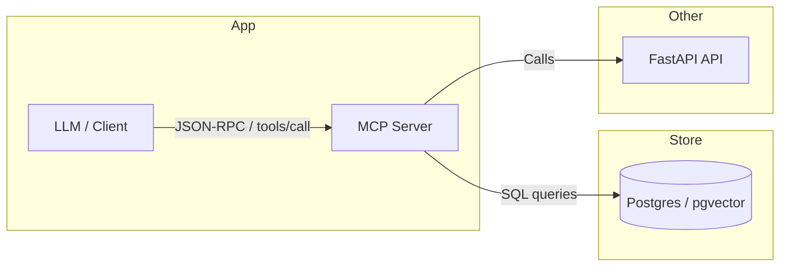

# RAG MCP Server Guide

中文: [README.md](README.md)

## Overview

This is a RAG (Retrieval Augmented Generation) server built on MCP (Model Context Protocol) focused on document retrieval functionality. It does not provide dialogue generation; instead, it offers efficient document content retrieval that can be used by other AI models.

## Features

- ✅ **Semantic Search**: Vector-based document retrieval
- ✅ **Document Management**: List and retrieve document details
- ✅ **Statistics**: Provide search and document metrics
- ✅ **MCP Protocol**: Standard MCP interface for easy integration
- ✅ **High Performance**: Uses SQLite database and cosine similarity

## Installation and Configuration

### 1. Requirements

- Python 3.8+
- Poetry (recommended) or pip
- SQLite

### 2. Install dependencies

```bash
# Using Poetry (recommended)
poetry install

# Or using pip
pip install -r requirements.txt
```

### 3. Environment variables

Create a `.env` file or set environment variables:

```bash
# OpenAI API configuration (for embeddings)
OPENAI_API_KEY=your_openai_api_key_here
OPENAI_URL=https://api.openai.com/v1
EMBEDDING_MODEL_NAME=text-embedding-ada-002

# Database configuration
DATABASE_PATH=rag_mcp.db

# Search configuration
DEFAULT_SIMILARITY_THRESHOLD=0.7
DEFAULT_SEARCH_LIMIT=5
MAX_SEARCH_RESULTS=50
```

## Usage

### 1. Start server

Two transports are supported: stdio (for direct stdio communication) and Streamable HTTP (recommended for LLM clients).

Stdio mode (default):

```bash
# Use startup script (stdio mode)
PYTHONPATH=. poetry run python mcp/scripts/start_server.py --transport stdio
```

Streamable HTTP mode (recommended):

```bash
# Start server in HTTP mode, default listening on 127.0.0.1:18080
PYTHONPATH=. poetry run python mcp/server/mcp_server.py --transport http --http-host 127.0.0.1 --http-port 18080
```

### 2. Test server

```bash
# Run full tests
PYTHONPATH=. poetry run python mcp/scripts/test_mcp_server.py

# Run demo
PYTHONPATH=. poetry run python mcp/scripts/demo.py
```

### Streamable HTTP / JSON-RPC endpoint

When running MCP Server in HTTP mode, you can send JSON-RPC requests to:

- `http://127.0.0.1:18080/jsonrpc`

Example using `curl` to call `rag_search`:

```bash
curl -s -X POST "http://127.0.0.1:18080/jsonrpc" \
  -H "Content-Type: application/json" \
  -d '{"jsonrpc":"2.0","id":1,"method":"tools/call","params":{"name":"rag_search","arguments":{"query":"mental health","limit":5}}}'
```

### Developer Notes

- Use curl, Postman, or any JSON-RPC client to interact with the server in HTTP mode.
- Use `--transport stdio` for local in-process usage or piping via stdio.
- Set `MCP_HTTP_HOST` and `MCP_HTTP_PORT` in `.env` to override defaults.

### Architecture (Mermaid)



## MCP Tools

The server offers the following 4 MCP tools:

### 1. `rag_search` - Semantic Search

Searches for related document chunks based on a query text.

**Parameters**:

- `query` (required): The query string
- `limit` (optional): Number of results to return (default 5)
- `threshold` (optional): Similarity threshold (default 0.7)
- `document_ids` (optional): List of document IDs to restrict search

**Response**:

```json
{
  "results": [
    {
      "chunk_id": 8,
      "document_id": 12,
      "document_name": "AI psychology system requirements.md",
      "content": "Document content...",
      "similarity_score": 0.85,
      "chunk_index": 0
    }
  ],
  "total_results": 1,
  "query_time_ms": 150,
  "success": true
}
```

### 2. `list_documents` - List Documents

Get a list of all searchable documents.

**Parameters**: None

**Response**:

```json
{
  "documents": [
    {
      "id": 12,
      "filename": "AI psychology system requirements.md",
      "file_type": ".md",
      "file_size": 25600,
      "chunk_count": 9,
      "created_at": "2025-01-15 10:30:00"
    }
  ],
  "total_documents": 3,
  "success": true
}
```

### 3. `get_document` - Document Details

Get the details of a specified document and all chunks.

**Parameters**: `document_id` (required)

**Response**: see example in original README

### 4. `search_statistics` - Search Statistics

Get statistics about searches and documents.

**Parameters**: None

**Response**: see example in original README

## Integration Example

### Python client example

```python
import asyncio
import json
from mcp.simple_mcp_server import MCPServer

async def search_documents(query: str):
    server = MCPServer()

    request = {
        "jsonrpc": "2.0",
        "id": 1,
        "method": "tools/call",
        "params": {
            "name": "rag_search",
            "arguments": {
                "query": query,
                "limit": 5,
                "threshold": 0.7
            }
        }
    }

    response = await server.handle_request(request)
    content = json.loads(response['result']['content'][0]['text'])

    return content['results']

# Usage example
results = asyncio.run(search_documents("psychological counseling"))
for result in results:
    print(f"Similarity: {result['similarity_score']:.2f}")
    print(f"Content: {result['content'][:100]}...")
```

(See README.md for more details and example using Streamable HTTP client.)

## File Structure

```
mcp/
├── __init__.py                    # package init
├── README.md                      # server guide
├── core/                          # core logic
├── server/                        # server implementation
└── scripts/                       # utility scripts
```

## Performance Metrics

- Single search response time: < 500ms
- Concurrent requests supported: >= 10
- Memory usage: < 1GB
- Supported documents: >= 1000

## Error Handling

The server returns standard error response objects (see README.md for example).

## Development and Extension

### Adding new tools

1. Add new handler in `rag_handler.py`
2. Register new tool in `simple_mcp_server.py`
3. Update tool list and behavior

### Custom search algorithm

You can modify the `VectorSearchService` in `core/services.py` to implement custom similarity calculations.

## Troubleshooting

### Common Issues

1. **ModuleNotFoundError**: Ensure you run within the virtual environment
2. **API Key errors**: Check `OPENAI_API_KEY`
3. **Database errors**: Make sure `rag_mcp.db` exists

## Changelog

- **v1.0.0** (2025-01-15): Initial release

## License

[MIT License](../LICENSE)

## Contributing

Please file issues and PRs!

---

**Note**: This server is focused on document retrieval and does not provide dialog generation. For full RAG dialog functionality, please see other project components.
